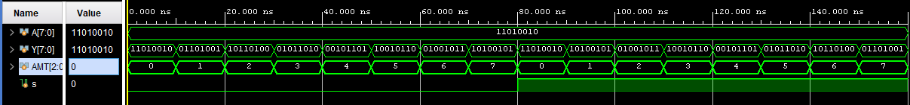
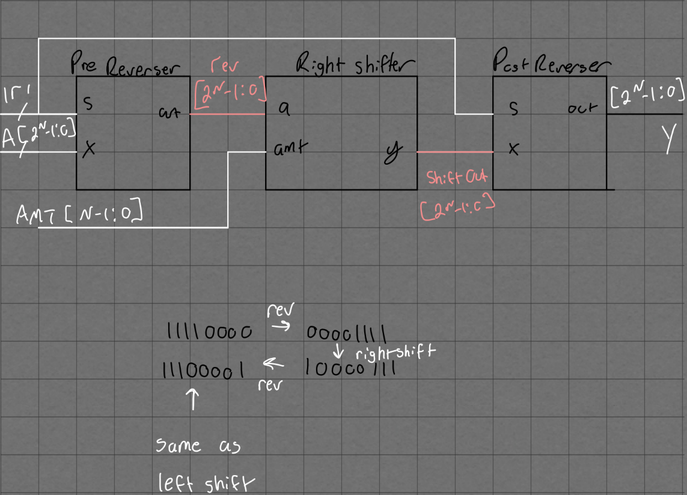
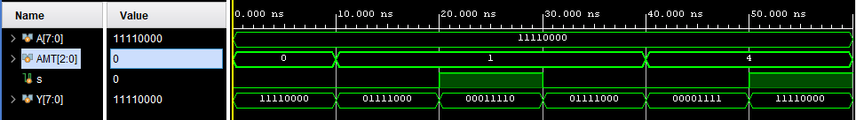

# ECE4305Lab1
**Part 1**
- Left shifter methodology

- Parameterized right and left shifter test bench

**Part 2**
- Multi Barrel Shifter Mux Block Diagram

- Multi Barrel Shifter Mux Test Bench

 
 
- Multi Barrel Shifter Reverser Block Diagram

- Multi Barrel Shifter Reverser Test Bench

 
**FPGA Implementaion**

-Multi Barrel Shifter Mux Video
  - https://drive.google.com/file/d/1RYJBj_R52hWVogVbnqKj6DFjj_Z-ExC1/view?usp=sharing

-Multi Barrel Shifter Reverser Video
  - https://drive.google.com/file/d/1us6cKSGMO7L93oxxVhYuwLKeONIZfoiI/view?usp=sharing
  
-Logic Cell Table

